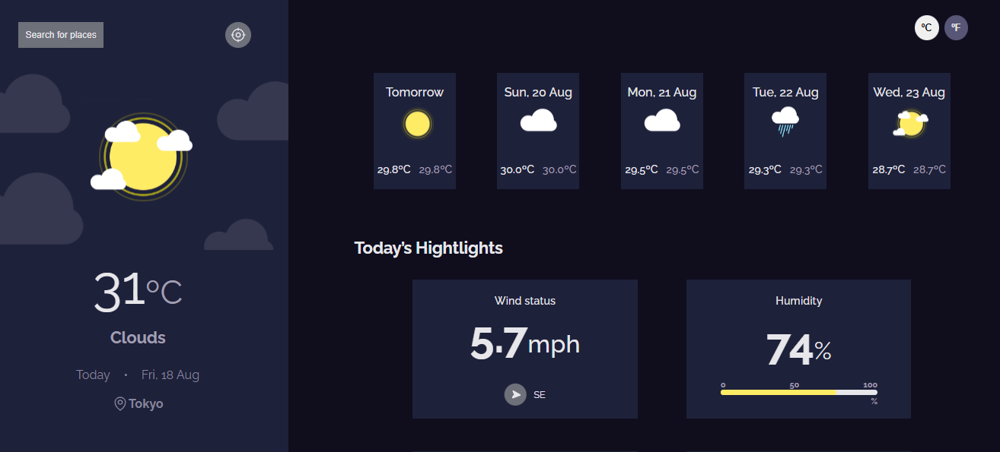

## 
Weather app

Um site de climas desenvolvido com React.js, é possível verificar as condições climáticas de qualquer lugar no mundo com apenas um clique!

 

  

## 🚀 Desenvolvido com:

- REACT
- JavaScript
- CSS
- Vite
- Git
- Github

## 💻 Projeto:

- [Live](https://weatherapi-sue.netlify.app/)

 

Coded by Suzane Feitosa ♡ 

 

Importante: O projeto foi desenvolvido utilizando a API "OpenWeather". Para que você consiga executar o projeto localmente é necessário solicitar a sua chave da API no link: https://openweathermap.org/api e incluí-la no arquivo .env conforme o .env.example. Caso você deseje ver apenas o funcionamento do projeto, basta clicar no link Live.
